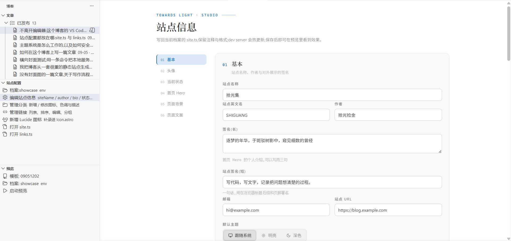
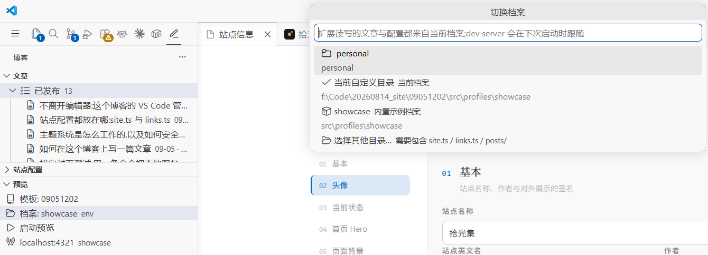
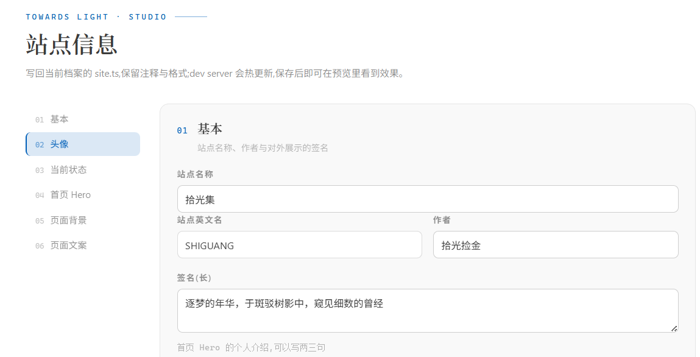
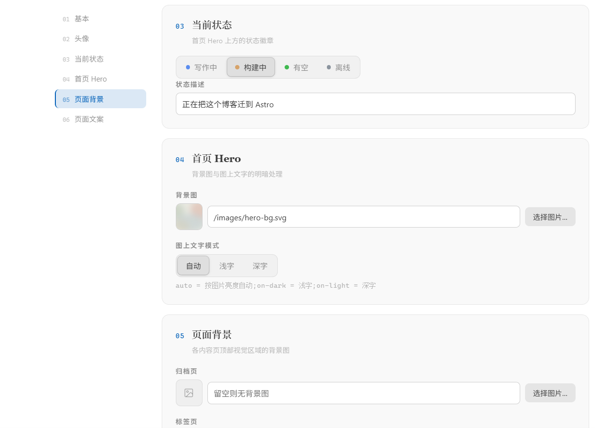
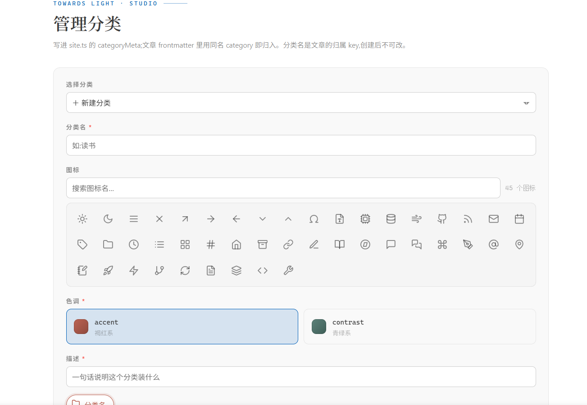
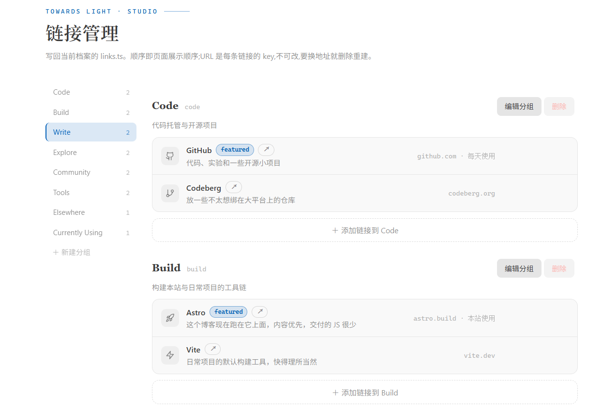

# TowardsLight 博客插件

TowardsLight 博客的本地写作与站点管理扩展：文章、配置、分类、链接、预览，全部收进 VS Code 侧边栏，写作全程不离开编辑器。



## 为什么是插件

这个博客的内容和配置都在文件里：文章是 Markdown，站点配置是 `site.ts`，链接目录是 `links.ts`。手写这些文件不难，难的是写作流程里每一次「开终端、找文件、翻字段、刷浏览器」都在打断状态。这个扩展把整条动线收进编辑器：**侧边栏新建 → 编辑器里写 → 右键插图 → 行内预览**。

## 功能

### 控制台（自绘侧边栏）

侧边栏是自定义 WebviewView，不用 VS Code 原生树：档案/模板绑定行、预览控制（启动/停止/日志）、管理入口、新建文章，全部设计系统自绘。

### 预览控制台

- **模板 / 档案双绑定**：模板（Astro 工程）与档案（内容包）各自独立选择，自动识别 + 手动覆盖
- 一键启动预览：在模板目录起 `npm run dev`，档案经环境变量注入；给出预览地址，可面板内打开（iframe 真实渲染）或浏览器打开
- **server 账本制**：同「模板 + 档案」组合自动复用，端口被占自动顺延；跨会话的孤儿进程按 PID 账本回收
- **单预览纪律**：档案的 junction 指向全局唯一，异档案 server 并存必然互踩——**切换档案的那一刻就主动停掉旧档案的预览**，不自动重启；点「启动预览」才起新档案的 server（若仍有残留旧 server，启动时兜底停掉）
- **指向感知**：轮询 junction 实际指向，被外部进程改动时记日志；与当前绑定不一致时轻提醒
- **激活自检**:`src/profiles/active` 与 `public/images` 指向缺失时按当前档案自动补齐
- **日志进输出面板**：dev server 的 stdout/stderr 逐行汇入输出面板的「TowardsLight 预览」频道，启动失败自动亮出并附输出末尾几行



### 文章中心

列表形态管理当前档案的全部文章：

- 完整信息：封面缩略图、标题、描述、日期、更新日期、分类、标签、状态徽章（草稿/已发布/异常）
- 搜索（标题/描述/标签/slug 多词与）、状态与分类筛选、计数
- 行内操作：打开编辑、预览、发布/转草稿一键切换、删除（系统回收站，可恢复）
- 批量管理：勾选后批量设为发布 / 转为草稿 / 删除
- 新建文章入口（slug 由标题派生、分类补全、封面选图自动归档进 `posts/image/<slug>/`)

另有：Markdown 右键「插入正文图片」，多选复制归档 + 光标处插入引用，与 VS Code 原生粘贴同一套目录约定。

### 站点信息

卡片式长表单，左侧目录 + scrollspy:站点名 / 作者 / 签名 / 头像 / 当前状态 / 默认主题 / Hero / 各页背景 / 各页文案。

- 图片字段带**实时缩略图**,「选择图片…」自动归档进档案 `images/`
- 所有写回都是 **AST 级就地修改**,注释、格式、`as const` 断言原样保留
- **草稿指纹**：未保存的输入在面板重建后恢复；文件在别处变动后旧草稿自动作废，以文件为准

<table>
  <tr>
    <td width="58%"></td>
    <td width="42%"></td>
  </tr>
</table>

### 管理分类

新建 / 编辑双模式，图标选择器（可搜索）、双色池色调、底部胶囊实时预览。分类名是文章引用的 key:**有引用的分类锁定改名与删除**，下拉里标注引用篇数。



### 管理链接

有序模块列表，不是表单：分组分段、行内展开编辑、↑↓ 组内排序、**分组头拖拽排序**、两段式删除；分组可新建 / 改显示名 / 删空组。



### 图标补录

输入 lucide.dev 上的图标名，自动从 lucide-static 提取 SVG 补录进模板的 `Icon.astro`，分类与链接表单立即可用，但是记得重进页面刷新一下，不然新图标不会出现哦

## 安装

暂不上架市场，vsix 直装：

```bash
code --install-extension towards-light-editor-0.6.1.vsix
```

装完 **Reload Window** 生效。要求：工作区是 TowardsLight 博客项目（含 `scripts/use-profile.mjs`)。

## 档案机制

与 `scripts/use-profile.mjs` 同一套解析顺序：`SITE_PROFILE_DIR` > `./personal/` > 内置 `showcase`。点击「档案：xxx」可在扫描到的档案间切换（根目录往下两层），或选择任意自定义目录；选择持久化，重载窗口后仍生效。

**表单档案锁定**：所有配置/新建表单在打开那一刻锁定档案，右上角徽章标明作用目标；打开后再切换绑定，提交会被拒绝并提示重开——宁可重开，不写错档案。

## 图片资产约定

```
<档案>/
├── images/                     ← 站点级:头像、Hero/页面背景,按 /images/... 引用
└── posts/
    ├── my-post.md
    └── image/<my-post>/        ← 文章级:封面与正文插图,按文章名归目录,相对路径引用
```

复制不移动源文件；撞名自动加 `-2` 后缀，不覆盖（正文可能正引用旧图）。

## 开发

```bash
npm install
npm run build      # esbuild 双产物:dist/extension.js + dist/core.mjs
npm test           # 核心读写逻辑(26 项断言,跑在 showcase 副本上)
npm run package    # 产出 vsix
```

调试：在 VS Code 里打开 `editor/` 目录按 `F5`,启动扩展开发宿主并自动打开博客项目。

```
src/core/        纯逻辑层(不依赖 vscode,Node 下可测)
src/webviews/    四个表单 webview(共享一套设计系统)
src/preview.ts   dev server 账本与 iframe 面板
src/posts.ts     文章树
```

## Roadmap

- 文章树增强：按分类/标签分组筛选
- 已发布文章的元数据编辑、草稿 ⇄ 发布切换、删除文章
- 明确不做：重命名 slug、定时发布
